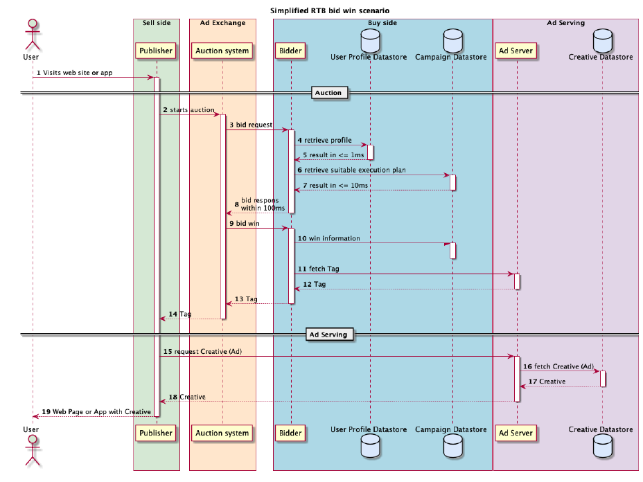
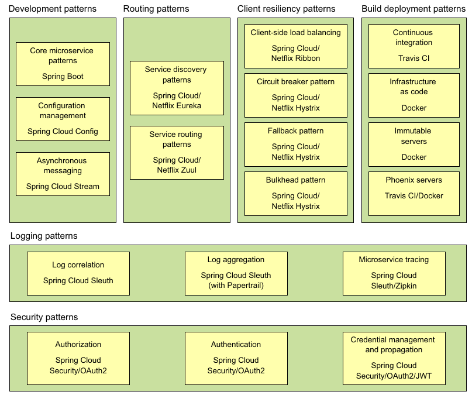

This repository is the parent repository for the all applications that belong to the AdTech platform. The real-life platforms are very complicated and so this repository considers a simplified scenario.

## Overview

In an AdTech ecosystem, first the user visits the webpage (step 1). The webpage then 'sells' the ad-space on the webpage on the 'ad exchange' (step 2). The 'buyers' bid for the space and the ad exchange decides the winning bid (step 3). In the end, the winner's ad is served on the page (step 4). This all has to happen within a few milliseconds e.g. Google waits maximum 120 milliseconds to receive bids from the buyers.

Overall, we need to build a system which needs to satisfy below requirements:
- Highly available : If the system goes down, there will be huge loss of revenue.
- Highly scalable : The volume is high and it continuously growing e.g. ProSieben's platform handles 600K requests per second.
- Agile : The platform needs to adapt to the changing business requirements continuously.
- Low latency : All these steps need to happen without hampering the webpage user experience.

## Details 

A simplified publish-bid-win scenario looks like below. It is taken from the [Aerospike document](documents/Aerospike_Whitepaper__AdTech-Reference-Architecture.pdf).

Note : A 'tag' is used to collect user interaction events for the ad. To simplify the scenario, we will not collect the event data.

This project is divided into four applications: seller, ad-exchange, buyer and ad server. For each application, there is a corresponding repository as given below. I am using microservice based architecture for developing them as it offers agility. I used the [Spring Microservices in Action](https://www.manning.com/books/spring-microservices-in-action) book for reference.

- Seller
- Ad exchange
- Buyer
- [Ad server](https://github.com/nikhilbchilwant/Ad-server)

## Tech stack
The platform will built using the same tech stack used in the [Spring Microservices in Action](https://www.manning.com/books/spring-microservices-in-action) book.  

## References

- [Aerospike document](documents/Aerospike_Whitepaper__AdTech-Reference-Architecture.pdf)
- [Google cloud blog](https://cloud.google.com/architecture/infrastructure-options-for-building-advertising-platforms)